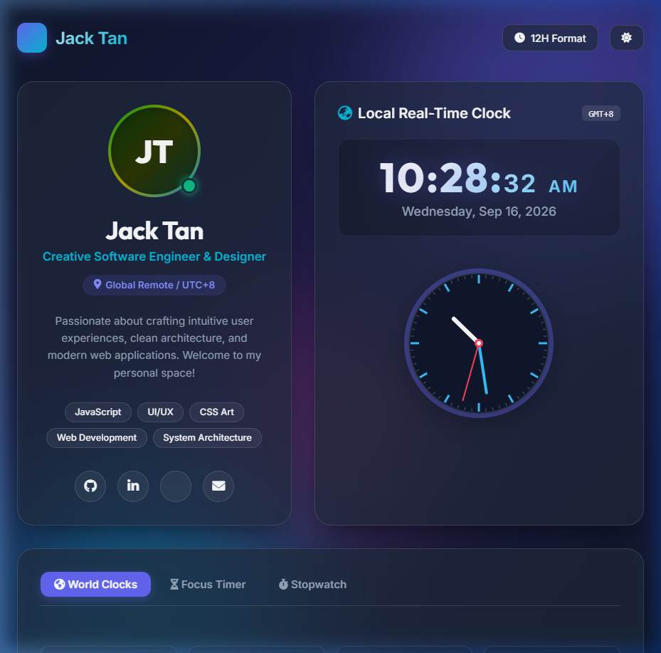
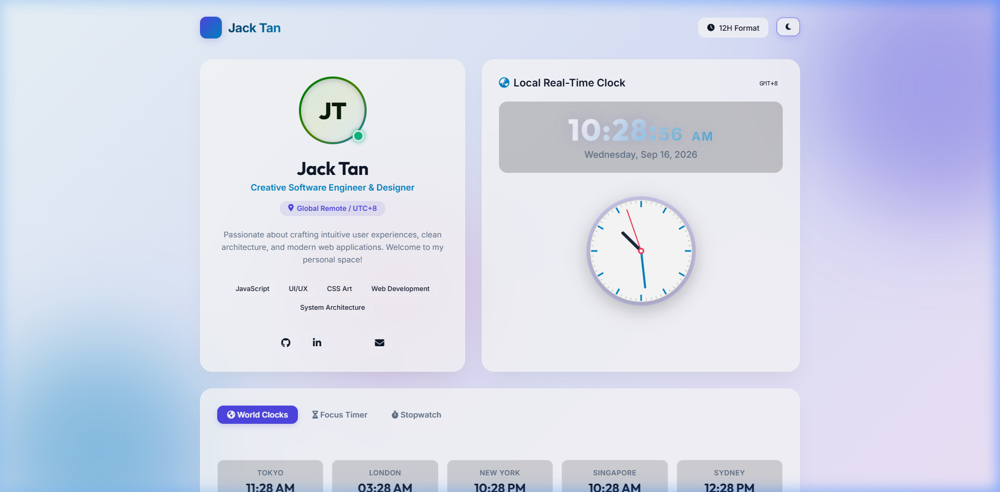

# 🌟 Jack Tan - Personal Page & Time Dashboard

[](https://aghoniln.github.io/0916/)
[](LICENSE)
[](#)
[](#)
[](#)

> 🔗 **Live Website Demo**: [https://aghoniln.github.io/0916/](https://aghoniln.github.io/0916/)

---

## 📸 Snapcast / Page Preview

### Dark Mode (Default)


### Light Mode


---

## 👨‍💻 About Me (Jack Tan)

Hi there! 👋 I'm **Jack Tan**, a passionate Creative Software Engineer & Designer focused on building modern, high-performance web applications with intuitive UI/UX design. 

- 📍 **Location / Timezone**: Global Remote (UTC+8)
- 💼 **Role**: Creative Software Engineer / Full-Stack Web Developer
- 🌐 **Live Website**: [https://aghoniln.github.io/0916/](https://aghoniln.github.io/0916/)
- 🛠️ **Skills**: JavaScript / TypeScript, HTML5 / Modern CSS, System Architecture, UI/UX Design
- 🎯 **Goals**: Crafting smooth, responsive web applications and delivering exceptional digital experiences.

---

## ✨ Features of this Project

- ⏰ **Live Real-Time Digital Clock**: High-precision local digital clock displaying live hours, minutes, seconds, date, and timezone. Features 12-hour/24-hour toggle.
- 🎨 **HTML5 Canvas Analog Clock**: Custom canvas clock rendering with continuous smooth second hand movement.
- 🌍 **World Clocks Dashboard**: Live times across key global cities (*Tokyo, London, New York, Singapore, Sydney, Paris*) with automatic relative hour offset calculations.
- ⏱️ **Interactive Productivity Tools**: Integrated 25-minute Pomodoro Focus Timer and precision Stopwatch.
- 🌓 **Dark & Light Mode**: Seamless glassmorphism theme switcher with saved user preferences (`localStorage`).

---

## 💡 Suggestions: What Else You Can Add to Your Page & Profile

Here are great ideas to make your personal page and GitHub profile even more impressive:

### 1. 💼 Project Showcase & Portfolio
- Add a **Featured Projects** grid displaying your top GitHub repositories with screenshots, tech stack badges, and live demo links.

### 2. 📄 Interactive Resume & Timeline
- Include a **Career & Education Timeline** highlighting past experience, roles, and achievements.
- Add a **"Download Resume (PDF)"** button.

### 3. 📊 GitHub Stats & Live Widgets
- Integrate **GitHub Stats Cards** (`github-readme-stats`) showing your commit streaks, total stars, and top languages.
- Add a **Spotify Currently Playing Widget** using the Spotify API to display your current music status.

### 4. 📝 Tech Blog / Articles
- Add a **Blog Section** featuring markdown posts or RSS feeds from Medium, Hashnode, or Dev.to.

### 5. 📬 Functional Contact Form
- Integrate a working contact form connected to **EmailJS** or **Formspree** so visitors can message you directly.

### 6. 🎮 Interactive Easter Egg / Mini-Game
- Add a fun interactive element, such as a mini retro arcade game, terminal emulator, or interactive canvas particle effect on mouse hover.

---

## 🛠️ Quick Local Setup

1. **Clone the repository**:
   ```bash
   git clone https://github.com/aghoniln/0916.git
   cd 0916
   ```

2. **Serve locally**:
   ```bash
   python -m http.server 8080
   ```
   Open `http://localhost:8080` in your web browser.

---

© 2026 Jack Tan. Built with ❤️ and Vanilla Web Technologies.
