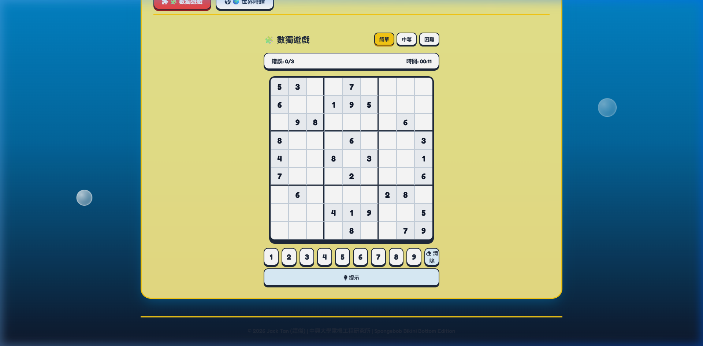

# 🧽 Jack Tan (譚人傑) - 海綿寶寶風格個人網站 & 數獨遊戲

[](https://aghoniln.github.io/0916/)
[](LICENSE)
[](#)
[](#)
[](#)

> 🔗 **Live Website**: [https://aghoniln.github.io/0916/](https://aghoniln.github.io/0916/)

---

## 📸 網站預覽 (Snapcast & Feature Previews)

### 🧽 海綿寶寶風格主頁 (Spongebob Theme Main View)


### 🧩 數獨遊戲 (Sudoku Game Board)


---

## 👨‍💻 關於 Jack Tan (譚人傑)

- 🎓 **學歷 / 研究所**: **中興大學電機工程研究所** (Graduate Institute of Electrical Engineering, NCHU)
- 🛠️ **核心專長**: **Python** | **C / C++** | **AI / Machine Learning** | JavaScript | UI/UX Design | 系統架構
- 🌐 **線上個人網站**: [https://aghoniln.github.io/0916/](https://aghoniln.github.io/0916/)

---

## ✨ 網站亮點與特色功能

1. 🧽 **海綿寶寶主題風格 (Bikini Bottom Theme)**:
   - 經典海綿黃、派大星粉、深海藍三種主題動態切換。
   - 動態海洋浮動氣泡背景與 Q 版幾何視覺卡片。

2. 🧩 **數獨遊戲 (Sudoku Game)**:
   - 完整 9x9 互動式數獨棋盤。
   - 提供「簡單 / 中等 / 困難」三種難度等級選擇。
   - 包含計時器、錯誤次數統計 (上限 3 次)、數字鍵盤、清除與提示功能。

3. ⏰ **即時時鐘與世界時鐘 Dashboard**:
   - 數字時鐘 (支援 12H/24H 切換)、HTML5 Canvas 平滑秒針模擬時鐘。
   - 全球主要城市 (東京、倫敦、紐約、新加坡、雪梨、巴黎) 即時世界時鐘。

---

## ✨ Features of this Project

- ⏰ **Live Real-Time Digital Clock**: High-precision local digital clock displaying live hours, minutes, seconds, date, and timezone. Features 12-hour/24-hour toggle.
- 🎨 **HTML5 Canvas Analog Clock**: Custom canvas clock rendering with continuous smooth second hand movement.
- 🌍 **World Clocks Dashboard**: Live times across key global cities (*Tokyo, London, New York, Singapore, Sydney, Paris*) with automatic relative hour offset calculations.
- ⏱️ **Interactive Productivity Tools**: Integrated 25-minute Pomodoro Focus Timer and precision Stopwatch.
- 🌓 **Dark & Light Mode**: Seamless glassmorphism theme switcher with saved user preferences (`localStorage`).

---

## 💡 Suggestions: What Else You Can Add to Your Page & Profile

Here are great ideas to make your personal page and GitHub profile even more impressive:

### 1. 💼 Project Showcase & Portfolio
- Add a **Featured Projects** grid displaying your top GitHub repositories with screenshots, tech stack badges, and live demo links.

### 2. 📄 Interactive Resume & Timeline
- Include a **Career & Education Timeline** highlighting past experience, roles, and achievements.
- Add a **"Download Resume (PDF)"** button.

### 3. 📊 GitHub Stats & Live Widgets
- Integrate **GitHub Stats Cards** (`github-readme-stats`) showing your commit streaks, total stars, and top languages.
- Add a **Spotify Currently Playing Widget** using the Spotify API to display your current music status.

### 4. 📝 Tech Blog / Articles
- Add a **Blog Section** featuring markdown posts or RSS feeds from Medium, Hashnode, or Dev.to.

### 5. 📬 Functional Contact Form
- Integrate a working contact form connected to **EmailJS** or **Formspree** so visitors can message you directly.

### 6. 🎮 Interactive Easter Egg / Mini-Game
- Add a fun interactive element, such as a mini retro arcade game, terminal emulator, or interactive canvas particle effect on mouse hover.

---

## 🛠️ Quick Local Setup

1. **Clone the repository**:
   ```bash
   git clone https://github.com/aghoniln/0916.git
   cd 0916
   ```

2. **Serve locally**:
   ```bash
   python -m http.server 8080
   ```
   Open `http://localhost:8080` in your web browser.

---

© 2026 Jack Tan (譚人傑). Built with ❤️ and Vanilla Web Technologies.
